# Sơ đồ hoạt động dự án LMS Trung Học Phổ Thông (LMS_THPT)

Tài liệu này chứa các sơ đồ hoạt động (Activity Diagrams) mô tả luồng xử lý nghiệp vụ của hệ thống LMS. Để tránh sơ đồ bị rối và dễ theo dõi, các chức năng cốt lõi được tách biệt thành 14 quy trình độc lập.

---

## Sơ đồ Tổng quan Sử dụng Hệ thống LMS

Sơ đồ hoạt động phân làn (swimlanes) thể hiện bức tranh toàn cảnh về cách các vai trò người dùng (Admin, Hiệu trưởng, Giáo viên, Học sinh) tương tác chéo với các tác vụ và dịch vụ hệ thống của LMS.

```mermaid
flowchart TD
    %% Phân làn (Swimlanes theo thứ tự từ trên xuống để tối ưu đường đi)
    subgraph Admin ["Admin"]
        StartNode(( ))
        A1["Quản lý Tài khoản"]
        A2["Quản lý Lớp & Môn học"]
    end

    subgraph GiaoVien ["Giáo viên"]
        GV1["Tạo & Gửi yêu cầu dạy bù / nghỉ phép"]
        GV2["Nhập & Cập nhật điểm số học sinh"]
    end

    subgraph HieuTruong ["Hiệu trưởng"]
        HT1["Xem yêu cầu chờ duyệt"]
        HT2["Phê duyệt / Từ chối"]
    end

    subgraph HeThong ["Hệ thống"]
        SYS1["Lưu CSDL & Cập nhật Trạng thái"]
        SYS2["Tự động tính Điểm TB & Xếp loại học lực"]
        SYS3["Tự động cập nhật Lịch học / dạy bù"]
    end

    subgraph HocSinh ["Học sinh"]
        HS1["Xem điểm số & Thời khóa biểu"]
        HS2["Làm bài tập & Nộp bài làm"]
        EndNode(( ))
    end

    %% Luồng kết nối
    StartNode --> A1
    A1 --> A2
    A2 --> SYS1
    GV1 -- "Gửi yêu cầu (ChoDuyet)" --> SYS1
    SYS1 -- "Hiển thị danh sách" --> HT1
    HT1 --> HT2
    HT2 -- "Duyệt dạy/học bù" --> SYS3
    HT2 -- "Từ chối / Duyệt thường" --> SYS1
    GV2 -- "Gửi bảng điểm" --> SYS2
    SYS2 -- "Cập nhật bảng điểm" --> HS1
    SYS3 -- "Cập nhật TKB mới" --> HS1
    HS1 --> EndNode
    HS2 -- "Nộp bài làm (ChoChamDiem)" --> SYS1

    %% Gán class kiểu dáng cho Start/End Node
    class StartNode startNode;
    class EndNode endNode;

    %% Định nghĩa kiểu dáng chuẩn UML cho Start/End Node
    classDef startNode fill:#000,stroke:#000,stroke-width:1px,width:20px,height:20px;
    classDef endNode fill:#000,stroke:#000,stroke-width:6px,width:20px,height:20px;
```

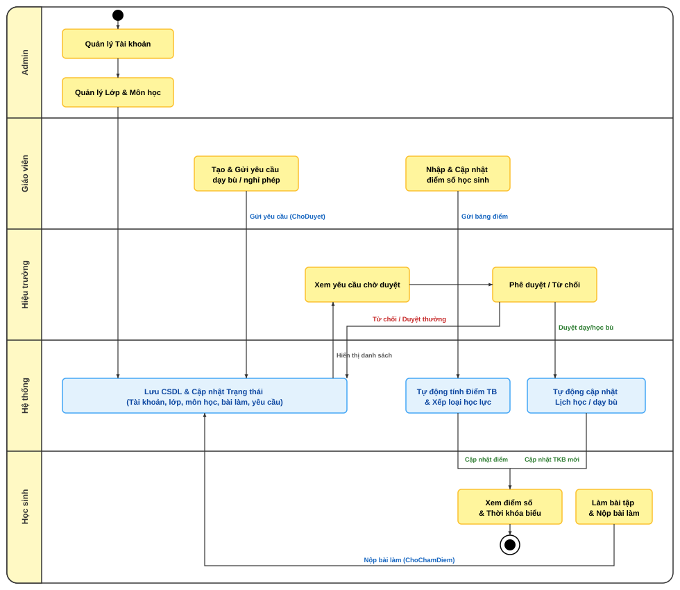

## 1. Xác thực & Điều hướng Vai trò

Quy trình người dùng truy cập hệ thống, đăng nhập thông qua ASP.NET Core Identity và được điều hướng về Dashboard tương ứng dựa trên vai trò của họ (Admin, Hiệu trưởng, Giáo viên, Học sinh).

```mermaid
flowchart TD
    %% Phân làn (Swimlanes)
    subgraph NguoiDung ["Người dùng"]
        StartNode(( ))
        Box1["Nhập thông tin đăng nhập"]
        Box4["Nhập lại thông tin đăng nhập"]
        
        %% Thanh phân nhánh Fork/Join
        ForkBar[=== Fork ===]
        
        Box7["Học sinh: Xem bài giảng, Làm và nộp bài tập"]
        Box8["Giáo viên: Tạo bài tập, Chấm điểm, Đăng tài liệu"]
        Box9["Admin/Hiệu trưởng: Quản lý người dùng, Xem thống kê"]
        
        EndNode(( ))
    end

    subgraph HeThong ["Hệ thống"]
        Box2["Kiểm tra cơ sở dữ liệu"]
        Diamond1{"Thông tin hợp lệ?"}
        Box3["Hiển thị thông báo lỗi"]
        Box5["Xác định vai trò (Role)"]
        Box6["Hiển thị giao diện Dashboard tương ứng"]
    end

    %% Luồng hoạt động
    StartNode --> Box1
    Box1 --> Box2
    Box2 --> Diamond1
    
    Diamond1 -- "Sai" --> Box3
    Box3 --> Box4
    Box4 --> Box1
    
    Diamond1 -- "Đúng" --> Box5
    Box5 --> Box6
    Box6 --> ForkBar
    
    ForkBar --> Box7
    ForkBar --> Box8
    ForkBar --> Box9
    
    Box7 --> EndNode
    Box8 --> EndNode
    Box9 --> EndNode

    %% Gán class kiểu dáng cho Start/End Node
    class StartNode startNode;
    class EndNode endNode;

    %% Định nghĩa kiểu dáng chuẩn UML cho Start/End Node
    classDef startNode fill:#000,stroke:#000,stroke-width:1px,width:20px,height:20px;
    classDef endNode fill:#000,stroke:#000,stroke-width:6px,width:20px,height:20px;
```

---

## 2. Giáo viên Tạo & Gửi Yêu cầu

Quy trình giáo viên đề xuất các yêu cầu như đăng ký lớp chủ nhiệm hoặc xin nghỉ phép, dạy bù lên Ban giám hiệu.

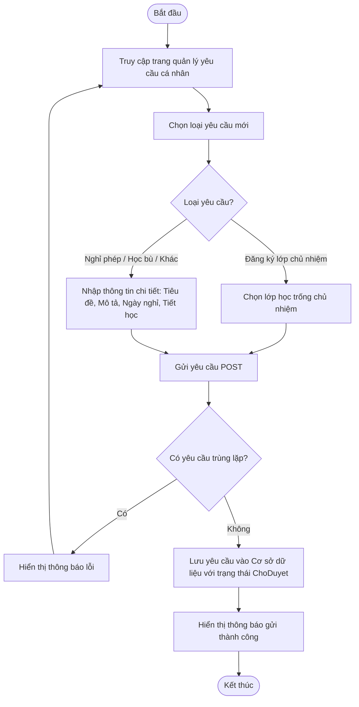
```mermaid
flowchart TD
    Start([Bắt đầu]) --> ViewRequestPage[Truy cập trang quản lý yêu cầu cá nhân]
    ViewRequestPage --> ChooseType[Chọn loại yêu cầu mới]
    ChooseType --> CheckType{Loại yêu cầu?}
    
    CheckType -- "Đăng ký lớp chủ nhiệm" --> SelectClass[Chọn lớp học trống chủ nhiệm]
    CheckType -- "Nghỉ phép / Học bù / Khác" --> FillForm[Nhập thông tin chi tiết: Tiêu đề, Mô tả, Ngày nghỉ, Tiết học]
    
    SelectClass --> SubmitReq[Gửi yêu cầu POST]
    FillForm --> SubmitReq
    
    SubmitReq --> Verify{Có yêu cầu trùng lặp?}
    Verify -- "Có" --> ShowError[Hiển thị thông báo lỗi] --> ViewRequestPage
    Verify -- "Không" --> SaveDB[Lưu yêu cầu vào Cơ sở dữ liệu với trạng thái ChoDuyet]
    
    SaveDB --> Notify[Hiển thị thông báo gửi thành công]
    Notify --> End([Kết thúc])
```

---

## 3. Hiệu trưởng Duyệt & Xử lý Yêu cầu

Quy trình Hiệu trưởng xem xét và phê duyệt các yêu cầu từ giáo viên. Nếu duyệt lịch dạy bù, hệ thống sẽ tự động cập nhật thời khóa biểu.

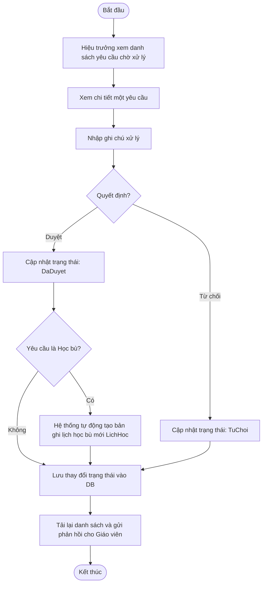
```mermaid
flowchart TD
    Start([Bắt đầu]) --> ViewRequests[Hiệu trưởng xem danh sách yêu cầu chờ xử lý]
    ViewRequests --> ClickDetail[Xem chi tiết một yêu cầu]
    ClickDetail --> InputNote[Nhập ghi chú xử lý]
    InputNote --> Decision{Quyết định?}
    
    Decision -- "Từ chối" --> Reject[Cập nhật trạng thái: TuChoi]
    Decision -- "Duyệt" --> Approve[Cập nhật trạng thái: DaDuyet]
    
    Approve --> CheckMakeup{Yêu cầu là Học bù?}
    CheckMakeup -- "Không" --> UpdateDB[Lưu thay đổi trạng thái vào DB]
    CheckMakeup -- "Có" --> AutoSchedule[Hệ thống tự động tạo bản ghi lịch học bù mới LichHoc]
    AutoSchedule --> UpdateDB
    
    Reject --> UpdateDB
    UpdateDB --> ReloadList[Tải lại danh sách và gửi phản hồi cho Giáo viên]
    ReloadList --> End([Kết thúc])
```

---

## 4. Giáo viên Nhập & Cập nhật Điểm số

Quy trình giáo viên nhập điểm cho học sinh. Hệ thống hỗ trợ chế độ xem lịch sử (chỉ đọc) hoặc chế độ hiện tại để chấm điểm, tính điểm tổng kết và tự động phân loại học lực.

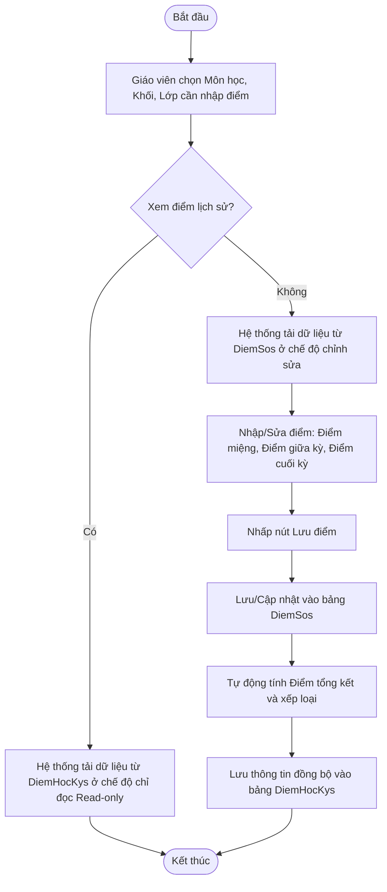
```mermaid
flowchart TD
    Start([Bắt đầu]) --> SelectCourse[Giáo viên chọn Môn học, Khối, Lớp cần nhập điểm]
    SelectCourse --> CheckHistory{Xem điểm lịch sử?}
    
    CheckHistory -- "Có" --> LoadHistory[Hệ thống tải dữ liệu từ DiemHocKys ở chế độ chỉ đọc Read-only]
    CheckHistory -- "Không" --> LoadCurrent[Hệ thống tải dữ liệu từ DiemSos ở chế độ chỉnh sửa]
    
    LoadCurrent --> EditScore[Nhập/Sửa điểm: Điểm miệng, Điểm giữa kỳ, Điểm cuối kỳ]
    EditScore --> ClickSave[Nhấp nút Lưu điểm]
    ClickSave --> UpdateDiemSo[Lưu/Cập nhật vào bảng DiemSos]
    UpdateDiemSo --> SyncDiemHocKy[Tự động tính Điểm tổng kết và xếp loại]
    SyncDiemHocKy --> SaveDiemHocKy[Lưu thông tin đồng bộ vào bảng DiemHocKys]
    
    LoadHistory --> End([Kết thúc])
    SaveDiemHocKy --> End
```

---

## 5. Học sinh Học tập & Nộp bài

Quy trình học sinh sử dụng cổng thông tin để xem lịch học, xem điểm số đã công bố và nộp các bài tập do giáo viên giao.

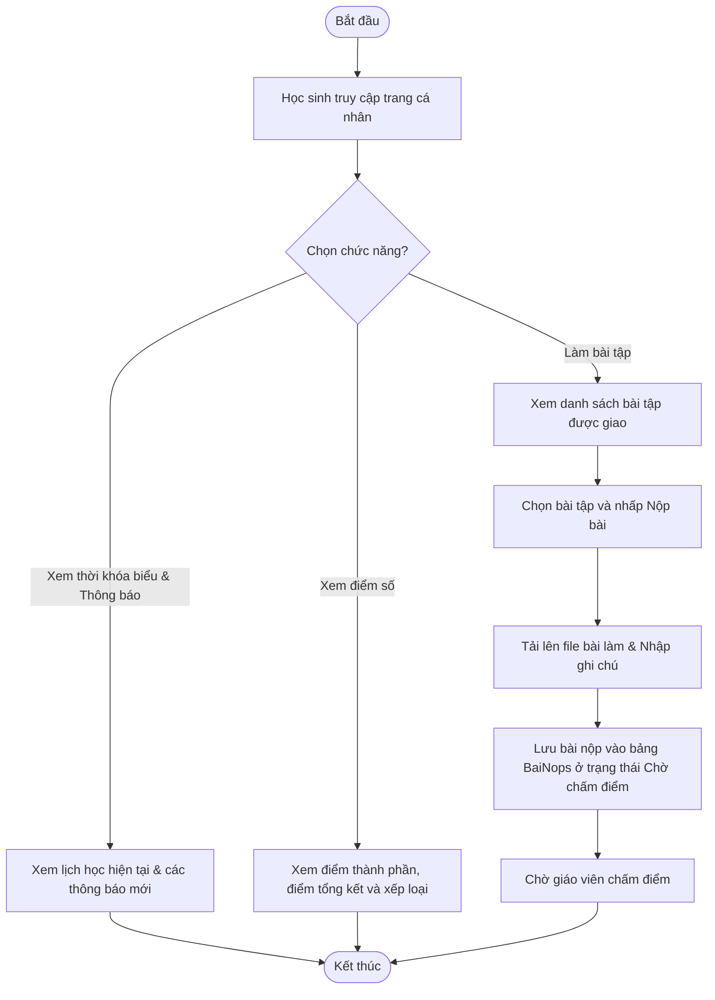
```mermaid
flowchart TD
    Start([Bắt đầu]) --> AccessStudent[Học sinh truy cập trang cá nhân]
    AccessStudent --> ChooseAction{Chọn chức năng?}
    
    ChooseAction -- "Xem thời khóa biểu & Thông báo" --> ViewSchedule[Xem lịch học hiện tại & các thông báo mới]
    ChooseAction -- "Xem điểm số" --> ViewGrades[Xem điểm thành phần, điểm tổng kết và xếp loại]
    ChooseAction -- "Làm bài tập" --> ViewAssignments[Xem danh sách bài tập được giao]
    
    ViewAssignments --> ClickSubmit[Chọn bài tập và nhấp Nộp bài]
    ClickSubmit --> UploadFile[Tải lên file bài làm & Nhập ghi chú]
    UploadFile --> SaveSubmission[Lưu bài nộp vào bảng BaiNops ở trạng thái Chờ chấm điểm]
    
    SaveSubmission --> WaitGrading[Chờ giáo viên chấm điểm]
    
    ViewSchedule --> End([Kết thúc])
    ViewGrades --> End
    WaitGrading --> End
```

## 6. Quản lý Môn học

Quy trình quản trị viên thực hiện quản lý danh sách môn học, thêm mới môn học và phân công giáo viên phụ trách cho từng lớp học.

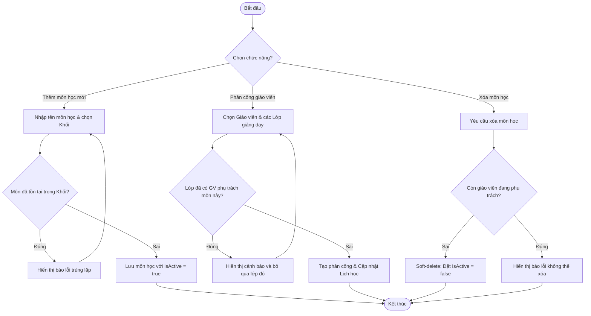
```mermaid
flowchart TD
    Start([Bắt đầu]) --> ChooseAction{Chọn chức năng?}
    
    %% Nhánh 1: Thêm môn học
    ChooseAction -- "Thêm môn học mới" --> CreateSub[Nhập tên môn học & chọn Khối]
    CreateSub --> CheckExist{Môn đã tồn tại trong Khối?}
    CheckExist -- "Đúng" --> ShowErrorSub[Hiển thị báo lỗi trùng lặp]
    ShowErrorSub --> CreateSub
    CheckExist -- "Sai" --> SaveNewSub[Lưu môn học với IsActive = true]
    
    %% Nhánh 2: Phân công giáo viên
    ChooseAction -- "Phân công giáo viên" --> AssignTeacher[Chọn Giáo viên & các Lớp giảng dạy]
    AssignTeacher --> CheckAssigned{Lớp đã có GV phụ trách môn này?}
    CheckAssigned -- "Đúng" --> ShowWarningAssign[Hiển thị cảnh báo và bỏ qua lớp đó]
    ShowWarningAssign --> AssignTeacher
    CheckAssigned -- "Sai" --> SaveAssign[Tạo phân công & Cập nhật Lịch học]
    
    %% Nhánh 3: Xóa môn học
    ChooseAction -- "Xóa môn học" --> DeleteSub[Yêu cầu xóa môn học]
    DeleteSub --> CheckGV{Còn giáo viên đang phụ trách?}
    CheckGV -- "Đúng" --> ShowErrorDelete[Hiển thị báo lỗi không thể xóa]
    CheckGV -- "Sai" --> SoftDeleteSub[Soft-delete: Đặt IsActive = false]
    
    %% Kết thúc
    SaveNewSub --> End([Kết thúc])
    SaveAssign --> End
    SoftDeleteSub --> End
    ShowErrorDelete --> End
```

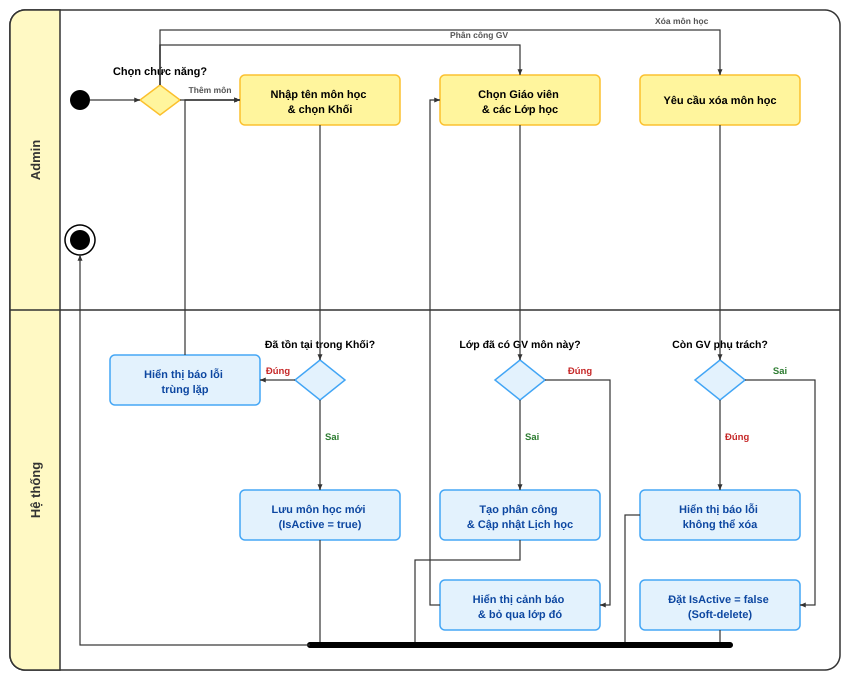

---

## 7. Quản lý Người dùng

Quy trình quản trị viên thực hiện quản lý tài khoản người dùng nói chung, giáo viên và học sinh nói riêng. Quy trình này kết hợp các kiểm tra nghiệp vụ và xử lý tự động của hệ thống (sinh mã tự động, khởi tạo bảng điểm, lưu trữ lịch sử khi xóa học sinh).

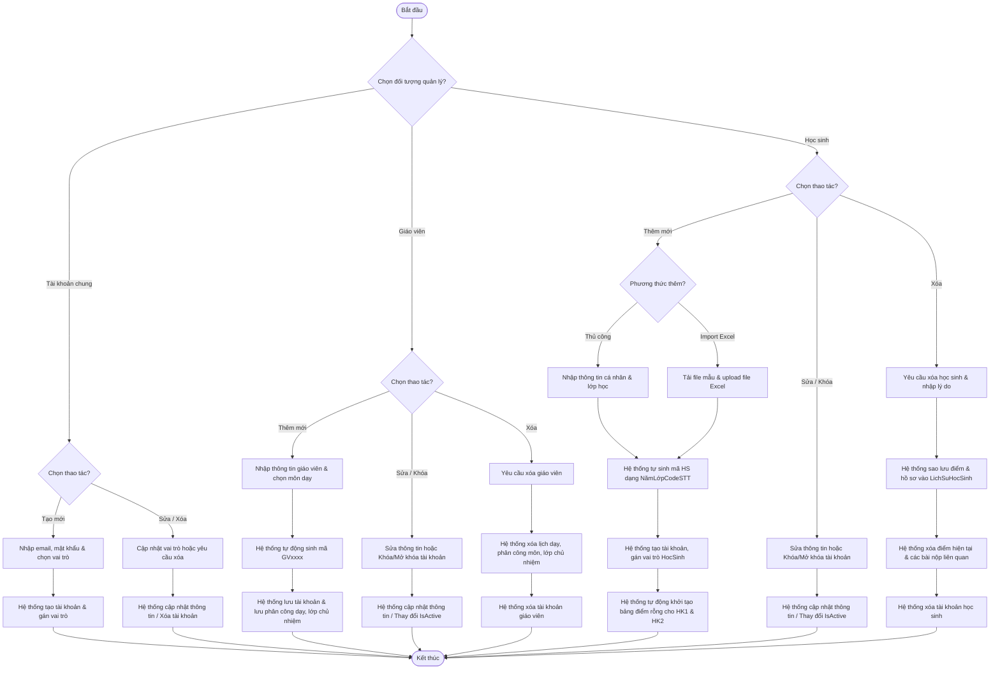
```mermaid
flowchart TD
    Start([Bắt đầu]) --> ChooseRole{Chọn đối tượng quản lý?}
    
    %% Phân nhánh Tài khoản chung
    ChooseRole -- "Tài khoản chung" --> ChooseActionAcc{Chọn thao tác?}
    ChooseActionAcc -- "Tạo mới" --> CreateAcc[Nhập email, mật khẩu & chọn vai trò]
    CreateAcc --> SaveAcc[Hệ thống tạo tài khoản & gán vai trò]
    ChooseActionAcc -- "Sửa / Xóa" --> EditOrDeleteAcc[Cập nhật vai trò hoặc yêu cầu xóa]
    EditOrDeleteAcc --> UpdateAcc[Hệ thống cập nhật thông tin / Xóa tài khoản]

    %% Phân nhánh Giáo viên
    ChooseRole -- "Giáo viên" --> ChooseActionGV{Chọn thao tác?}
    ChooseActionGV -- "Thêm mới" --> CreateGV[Nhập thông tin giáo viên & chọn môn dạy]
    CreateGV --> GenMaGV[Hệ thống tự động sinh mã GVxxxx]
    GenMaGV --> SaveGV[Hệ thống lưu tài khoản & lưu phân công dạy, lớp chủ nhiệm]
    ChooseActionGV -- "Sửa / Khóa" --> EditOrToggleGV[Sửa thông tin hoặc Khóa/Mở khóa tài khoản]
    EditOrToggleGV --> UpdateGV[Hệ thống cập nhật thông tin / Thay đổi IsActive]
    
    ChooseActionGV -- "Xóa" --> DeleteGV[Yêu cầu xóa giáo viên]
    DeleteGV --> CleanGV[Hệ thống xóa lịch dạy, phân công môn, lớp chủ nhiệm]
    CleanGV --> DeleteGVAcc[Hệ thống xóa tài khoản giáo viên]

    %% Phân nhánh Học sinh
    ChooseRole -- "Học sinh" --> ChooseActionHS{Chọn thao tác?}
    ChooseActionHS -- "Thêm mới" --> ChooseAddHSMethod{Phương thức thêm?}
    ChooseAddHSMethod -- "Thủ công" --> CreateHS[Nhập thông tin cá nhân & lớp học]
    ChooseAddHSMethod -- "Import Excel" --> UploadExcel[Tải file mẫu & upload file Excel]
    
    CreateHS --> GenMaHS[Hệ thống tự sinh mã HS dạng NămLớpCodeSTT]
    UploadExcel --> GenMaHS
    GenMaHS --> SaveHS[Hệ thống tạo tài khoản, gán vai trò HocSinh]
    SaveHS --> InitGrades[Hệ thống tự động khởi tạo bảng điểm rỗng cho HK1 & HK2]
    
    ChooseActionHS -- "Sửa / Khóa" --> EditOrToggleHS[Sửa thông tin hoặc Khóa/Mở khóa tài khoản]
    EditOrToggleHS --> UpdateHS[Hệ thống cập nhật thông tin / Thay đổi IsActive]
    
    ChooseActionHS -- "Xóa" --> DeleteHS[Yêu cầu xóa học sinh & nhập lý do]
    DeleteHS --> BackupHS[Hệ thống sao lưu điểm & hồ sơ vào LichSuHocSinh]
    BackupHS --> CleanHS[Hệ thống xóa điểm hiện tại & các bài nộp liên quan]
    CleanHS --> DeleteHSAcc[Hệ thống xóa tài khoản học sinh]

    %% Kết thúc
    SaveAcc --> End([Kết thúc])
    UpdateAcc --> End
    SaveGV --> End
    UpdateGV --> End
    DeleteGVAcc --> End
    InitGrades --> End
    UpdateHS --> End
    DeleteHSAcc --> End
```

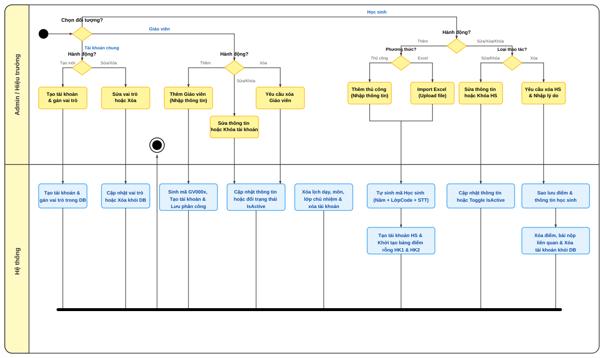

---

## 8. Quản lý Bài giảng & Tương tác

Quy trình Giáo viên đăng tải bài giảng/tài liệu và Học sinh xem tài liệu học tập, kết hợp chức năng phản hồi bình luận đa chiều giữa các bên.

```mermaid
flowchart TD
    %% Phân làn (Swimlanes)
    subgraph GiaoVien ["Giáo viên"]
        StartGV(( ))
        ChooseActionGV{"Chọn hành động?"}
        
        CreateBG["Soạn bài giảng & tải tài liệu đính kèm"]
        CommentGV["Viết bình luận / Trả lời phản hồi"]
    end

    subgraph HocSinh ["Học sinh"]
        StartHS(( ))
        ChooseActionHS{"Chọn hành động?"}
        
        ViewBG["Xem bài giảng & tải tài liệu học tập"]
        CommentHS["Viết bình luận / Trả lời phản hồi"]
    end

    subgraph HeThong ["Hệ thống"]
        SaveBG["Lưu bài giảng & phân loại tài liệu"]
        SaveComm["Lưu bình luận & cập nhật hiển thị Feed"]
        
        EndNode(( ))
    end

    %% Luồng Giáo viên
    StartGV --> ChooseActionGV
    ChooseActionGV -- "Đăng bài" --> CreateBG
    ChooseActionGV -- "Bình luận" --> CommentGV

    %% Luồng Học sinh
    StartHS --> ChooseActionHS
    ChooseActionHS -- "Xem bài" --> ViewBG
    ChooseActionHS -- "Bình luận" --> CommentHS

    %% Xử lý hệ thống & Liên kết luồng
    CreateBG --> SaveBG
    SaveBG --> ViewBG
    
    CommentGV --> SaveComm
    CommentHS --> SaveComm
    
    %% Các nhánh kết thúc kết nối về EndNode
    ViewBG --> EndNode
    SaveComm --> EndNode

    %% Gán class kiểu dáng cho Start/End Node
    class StartGV,StartHS startNode;
    class EndNode endNode;

    %% Định nghĩa kiểu dáng chuẩn UML cho Start/End Node
    classDef startNode fill:#000,stroke:#000,stroke-width:1px,width:20px,height:20px;
    classDef endNode fill:#000,stroke:#000,stroke-width:6px,width:20px,height:20px;
```

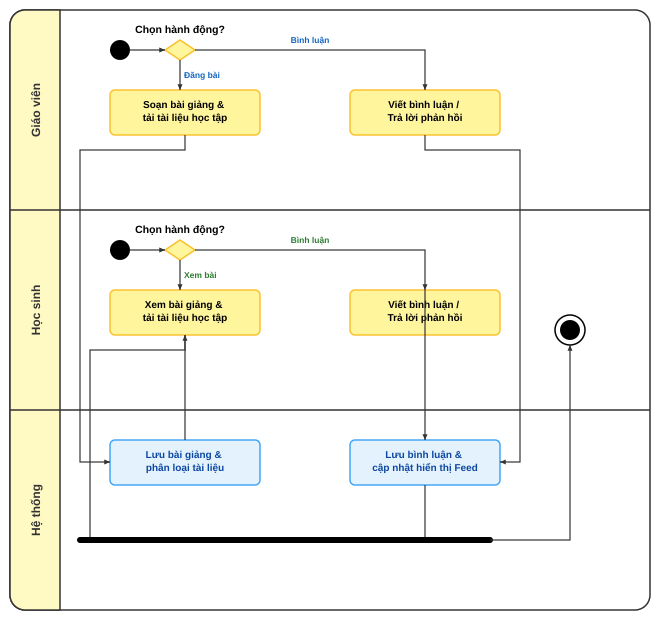

---

## 9. Quản lý Bài tập & Nộp bài

Quy trình giao nhận bài tập về nhà, xử lý tiếp nhận file bài làm của Học sinh (kiểm tra dung lượng, định dạng file) và Giáo viên theo dõi danh sách bài làm đã nộp.

```mermaid
flowchart TD
    %% Phân làn (Swimlanes)
    subgraph GiaoVien ["Giáo viên"]
        StartGV(( ))
        ChooseActionGV{"Chọn hành động?"}
        
        CreateBT["Tạo bài tập & thiết lập hạn nộp"]
        ViewSubs["Xem danh sách bài nộp của HS"]
    end

    subgraph HocSinh ["Học sinh"]
        StartHS(( ))
        DoBT["Làm bài & Tải lên bài làm (File/Nội dung)"]
        ShowErrorBT["Hiển thị báo lỗi định dạng/dung lượng"]
    end

    subgraph HeThong ["Hệ thống"]
        SaveBT["Tạo bài tập & mở cổng tiếp nhận"]
        CheckVal{"Hợp lệ? (<20MB, type)"}
        SaveSub["Lưu bài nộp & tính hạn nộp (Đúng hạn/Trễ)"]
        
        EndNode(( ))
    end

    %% Luồng Giáo viên
    StartGV --> ChooseActionGV
    ChooseActionGV -- "Tạo bài" --> CreateBT
    ChooseActionGV -- "Xem bài nộp" --> ViewSubs

    %% Luồng Học sinh
    StartHS --> DoBT

    %% Liên kết xử lý
    CreateBT --> SaveBT
    SaveBT --> DoBT
    
    DoBT --> CheckVal
    CheckVal -- "Sai" --> ShowErrorBT
    ShowErrorBT --> DoBT
    CheckVal -- "Đúng" --> SaveSub
    SaveSub --> ViewSubs

    %% Hội tụ về EndNode
    SaveBT --> EndNode
    ViewSubs --> EndNode

    %% Gán class kiểu dáng cho Start/End Node
    class StartGV,StartHS startNode;
    class EndNode endNode;

    %% Định nghĩa kiểu dáng chuẩn UML cho Start/End Node
    classDef startNode fill:#000,stroke:#000,stroke-width:1px,width:20px,height:20px;
    classDef endNode fill:#000,stroke:#000,stroke-width:6px,width:20px,height:20px;
```

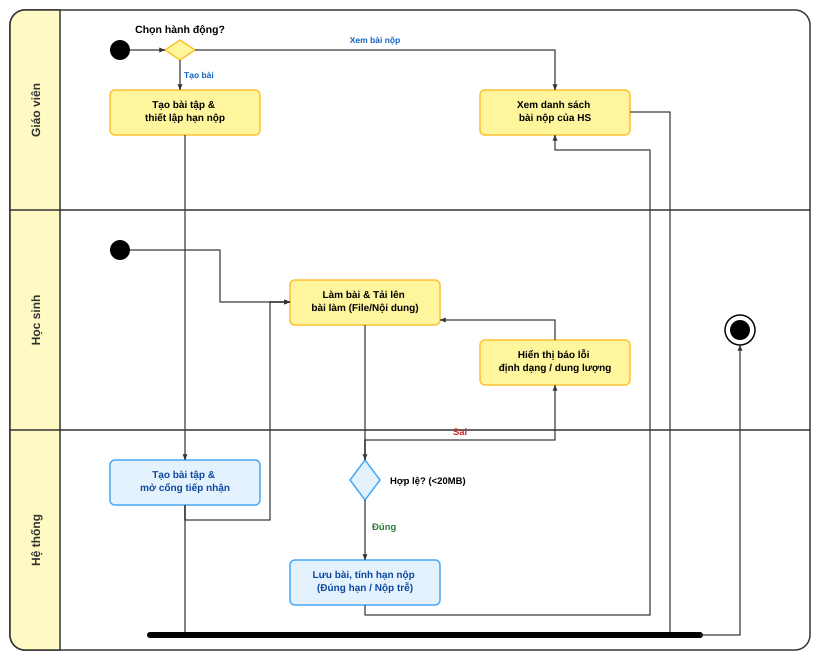

---

## 10. Quản lý Thời khóa biểu

Quy trình Quản trị viên (hoặc Hiệu trưởng) quản lý thời khóa biểu của các lớp học, bao gồm các chức năng xem/lọc thời khóa biểu theo ngày/lớp, thêm/sửa thủ công (có cơ chế tự động tải AJAX và kiểm tra trùng lịch dạy của Giáo viên, Lớp học, Phòng học), tải file Excel mẫu và nhập thời khóa biểu hàng loạt từ file Excel.

```mermaid
flowchart TD
    %% Phân làn (Swimlanes)
    subgraph QuanTriVien ["Quản trị viên / Hiệu trưởng"]
        StartQTV(( ))
        ChooseActionQTV{"Chọn chức năng?"}
        
        ViewTKB["Xem TKB lớp học & chọn tác vụ"]
        EditTKB["Thêm / Sửa TKB thủ công cho lớp"]
        UploadTKB["Chọn file Excel TKB & Tải lên"]
    end

    subgraph HeThong ["Hệ thống"]
        LoadTKB["Truy vấn DB, lọc theo Thứ & hiển thị TKB"]
        GenTemplate["Tạo file mẫu Excel & tải về máy QTV"]
        
        LoadAJAX["Tải AJAX danh sách Môn học & Giáo viên"]
        CheckConflict{"Trùng lịch? (Lớp/GV/Phòng)"}
        SaveTKB["Lưu dữ liệu TKB mới / sửa vào DB"]
        
        ReadExcel["Đọc file Excel & tìm Môn / GV theo tên"]
        SaveListTKB["Lưu danh sách TKB hợp lệ vào DB"]
        
        EndNode(( ))
    end

    %% Luồng Quản trị viên
    StartQTV --> ChooseActionQTV
    ChooseActionQTV -- "Xem TKB" --> ViewTKB
    ChooseActionQTV -- "Thêm / Sửa" --> EditTKB
    ChooseActionQTV -- "Import Excel" --> UploadTKB

    %% Luồng Xem TKB & Tải file mẫu
    ViewTKB --> LoadTKB
    LoadTKB --> ViewTKB
    ViewTKB -- "Tải file mẫu" --> GenTemplate

    %% Luồng Thêm / Sửa thủ công
    EditTKB --> LoadAJAX
    LoadAJAX --> EditTKB
    EditTKB -- "Nhấn Lưu" --> CheckConflict
    
    CheckConflict -- "Có (Báo lỗi)" --> EditTKB
    CheckConflict -- "Không" --> SaveTKB

    %% Luồng Import Excel
    UploadTKB --> ReadExcel
    ReadExcel --> SaveListTKB

    %% Hội tụ về EndNode
    GenTemplate --> EndNode
    SaveTKB --> EndNode
    SaveListTKB --> EndNode

    %% Gán class kiểu dáng cho Start/End Node
    class StartQTV startNode;
    class EndNode endNode;

    %% Định nghĩa kiểu dáng chuẩn UML cho Start/End Node
    classDef startNode fill:#000,stroke:#000,stroke-width:1px,width:20px,height:20px;
    classDef endNode fill:#000,stroke:#000,stroke-width:6px,width:20px,height:20px;
```

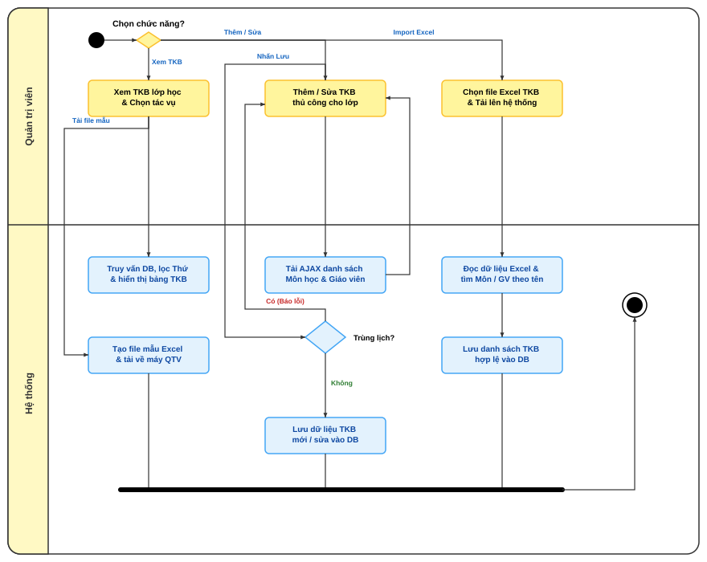

---

## 11. Quản lý Yêu cầu của Giáo viên

Quy trình Giáo viên gửi yêu cầu đăng ký lớp chủ nhiệm hoặc yêu cầu nghỉ phép, học bù/dạy bù. Yêu cầu được hệ thống kiểm tra sự hợp lệ (trùng lịch, trùng yêu cầu chờ duyệt) trước khi gửi tới Admin/Hiệu trưởng. Admin/Hiệu trưởng xem xét chi tiết để phê duyệt hoặc từ chối. Đối với yêu cầu học bù được duyệt, hệ thống sẽ tự động khởi tạo các tiết học bù tương ứng trong bảng lịch học. Giáo viên cũng có thể hủy bỏ yêu cầu đang trong trạng thái chờ xử lý.

```mermaid
flowchart TD
    %% Phân làn (Swimlanes)
    subgraph NguoiDung ["Giáo viên / Admin"]
        StartNode(( ))
        ChooseAction{"Chọn tác vụ?"}
        
        CreateReq["Tạo yêu cầu mới"]
        ProcessReq["Duyệt / Từ chối yêu cầu (Admin)"]
        CancelReq["Chọn hủy yêu cầu"]
    end

    subgraph HeThong ["Hệ thống"]
        LoadAJAX["Tải AJAX Môn/Tiết theo Lớp & Ngày"]
        CheckConflict{"Đã tồn tại / Trùng?"}
        SavePending["Lưu yêu cầu (Chờ duyệt)"]
        
        ChooseDecision{"Quyết định?"}
        SaveReject["Cập nhật trạng thái Từ chối & lý do"]
        SaveApprove["Cập nhật trạng thái Đã duyệt"]
        IsMakeUp{"Là dạy/học bù?"}
        GenSchedule["Tự động tạo bản ghi LichHoc (IsHocBu=true)"]
        
        SaveCancel["Hủy yêu cầu (HuyBo)"]
        
        EndNode(( ))
    end

    %% Luồng Giáo viên / Admin
    StartNode --> ChooseAction
    ChooseAction -- "Tạo yêu cầu" --> CreateReq
    ChooseAction -- "Duyệt / Từ chối" --> ProcessReq
    ChooseAction -- "Hủy yêu cầu" --> CancelReq

    %% Luồng Tạo yêu cầu
    CreateReq --> LoadAJAX
    LoadAJAX --> CreateReq
    CreateReq -- "Gửi yêu cầu" --> CheckConflict
    CheckConflict -- "Có (Báo lỗi)" --> CreateReq
    CheckConflict -- "Không" --> SavePending

    %% Luồng Duyệt / Từ chối
    ProcessReq --> ChooseDecision
    ChooseDecision -- "Từ chối" --> SaveReject
    ChooseDecision -- "Duyệt" --> SaveApprove
    SaveApprove --> IsMakeUp
    IsMakeUp -- "Có" --> GenSchedule
    IsMakeUp -- "Không" --> EndNode

    %% Luồng Hủy yêu cầu
    CancelReq --> SaveCancel

    %% Hội tụ về EndNode
    SavePending --> EndNode
    SaveReject --> EndNode
    GenSchedule --> EndNode
    SaveCancel --> EndNode

    %% Gán class kiểu dáng cho Start/End Node
    class StartNode startNode;
    class EndNode endNode;

    %% Định nghĩa kiểu dáng chuẩn UML cho Start/End Node
    classDef startNode fill:#000,stroke:#000,stroke-width:1px,width:20px,height:20px;
    classDef endNode fill:#000,stroke:#000,stroke-width:6px,width:20px,height:20px;
```

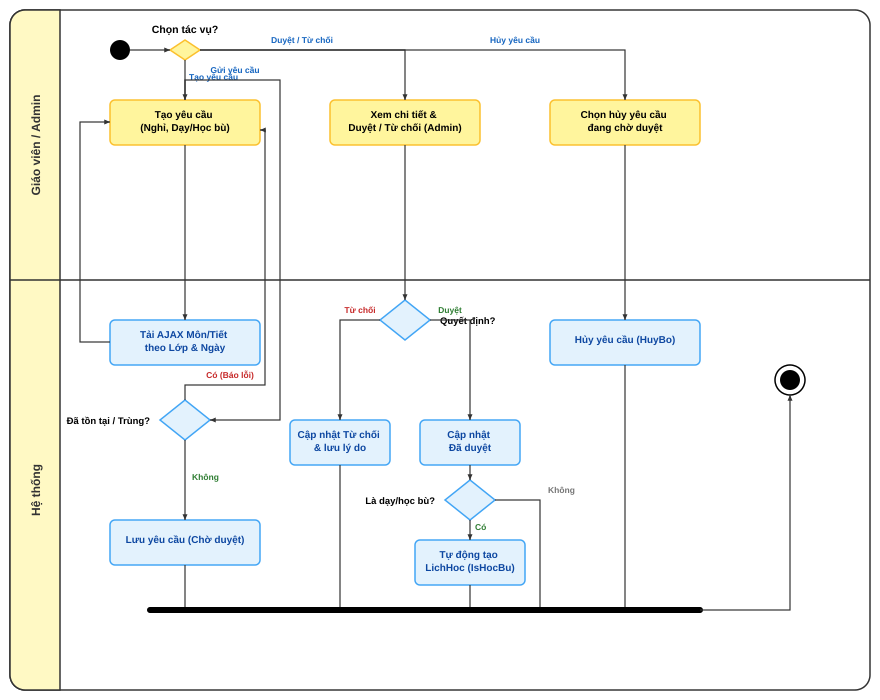

---

## 12. Quản lý Điểm số

Quy trình nhập, cập nhật điểm môn học (điểm miệng, điểm giữa kỳ, điểm cuối kỳ), chấm điểm bài tập tự luận/trắc nghiệm và đánh giá hạnh kiểm của học sinh. Hệ thống tự động đồng bộ điểm số sang bảng điểm học kỳ (DiemHocKy), tính điểm tổng kết và xếp loại học lực tương ứng dựa trên công thức cấu hình chuẩn.

```mermaid
flowchart TD
    %% Phân làn (Swimlanes)
    subgraph GiaoVien ["Giáo viên"]
        StartNode(( ))
        ChooseAction{"Chọn tác vụ?"}
        
        InputGrades["Nhập điểm môn học (Miệng, GK, CK)"]
        GradeAssignment["Chấm điểm bài tập (Bài nộp)"]
        EvaluateConduct["Đánh giá hạnh kiểm (GVCN)"]
    end

    subgraph HeThong ["Hệ thống"]
        SaveDiemSo["Lưu / Cập nhật bản ghi DiemSo"]
        SyncDiemHocKy["Đồng bộ sang DiemHocKy theo Học kỳ"]
        CalcAverage["Tính điểm tổng kết (MiệngTB + GK*2 + CK*3) / 6"]
        RankStudent["Xếp loại học lực (Giỏi, Khá, TB, Yếu, Kém)"]
        
        SaveBaiNop["Lưu điểm & nhận xét vào bản ghi BaiNop"]
        
        SaveConduct["Cập nhật HanhKiem vào hồ sơ NguoiDung"]
        
        EndNode(( ))
    end

    %% Luồng Giáo viên
    StartNode --> ChooseAction
    ChooseAction -- "Nhập điểm môn" --> InputGrades
    ChooseAction -- "Chấm bài tập" --> GradeAssignment
    ChooseAction -- "Đánh giá hạnh kiểm" --> EvaluateConduct

    %% Luồng Nhập điểm môn học
    InputGrades --> SaveDiemSo
    SaveDiemSo --> SyncDiemHocKy
    SyncDiemHocKy --> CalcAverage
    CalcAverage --> RankStudent

    %% Luồng Chấm điểm bài tập
    GradeAssignment --> SaveBaiNop

    %% Luồng Đánh giá hạnh kiểm
    EvaluateConduct --> SaveConduct

    %% Hội tụ về EndNode
    RankStudent --> EndNode
    SaveBaiNop --> EndNode
    SaveConduct --> EndNode

    %% Gán class kiểu dáng cho Start/End Node
    class StartNode startNode;
    class EndNode endNode;

    %% Định nghĩa kiểu dáng chuẩn UML cho Start/End Node
    classDef startNode fill:#000,stroke:#000,stroke-width:1px,width:20px,height:20px;
    classDef endNode fill:#000,stroke:#000,stroke-width:6px,width:20px,height:20px;
```

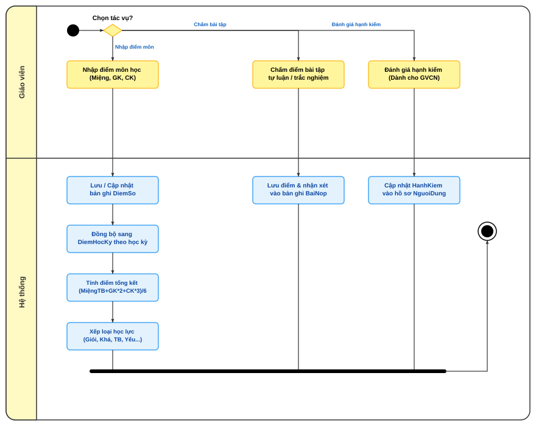

---

## 13. Quản lý Học sinh

Quy trình thêm học sinh mới (nhập tay hoặc import file Excel hàng loạt), sửa đổi thông tin cá nhân và xóa học sinh khỏi lớp học. Khi thêm học sinh mới, hệ thống tự động sinh mã học sinh tuần tự (dựa trên năm học, tên lớp, số thứ tự) và khởi tạo bảng điểm rỗng cho tất cả các môn của lớp đó. Khi xóa học sinh, hệ thống sẽ sao lưu toàn bộ thông tin cá nhân sang lịch sử (LichSuHocSinh) và lưu trữ snapshot điểm học tập cũ trước khi xóa sạch dữ liệu hoạt động để tránh xung đột khóa ngoại.

```mermaid
flowchart TD
    %% Phân làn (Swimlanes)
    subgraph Admin ["Admin / Hiệu trưởng"]
        StartNode(( ))
        ChooseAction{"Chọn tác vụ?"}
        
        CreateHS["Thêm học sinh mới"]
        UpdateHS["Sửa thông tin học sinh"]
        DeleteHS["Xóa học sinh"]
    end

    subgraph HeThong ["Hệ thống"]
        ChooseMode{"Hình thức thêm?"}
        GenMaHand["Tự sinh mã học sinh tuần tự"]
        ReadExcel["Đọc file Excel & sinh mã theo lô"]
        CreateAccount["Tạo tài khoản & gán vai trò Học sinh"]
        InitGrades["Khởi tạo điểm rỗng (DiemSo & DiemHocKy)"]
        
        CheckConflict{"Mã học sinh trùng?"}
        SaveUpdate["Lưu thông tin cập nhật vào CSDL"]
        
        BackupInfo["Lưu thông tin vào bảng LichSuHocSinh"]
        SnapshotGrades["Snapshot điểm sang LichSuDiemHocSinh"]
        DeleteFK["Xóa các bản ghi liên quan (DiemSo, BaiNop, DiemHocKy)"]
        DeleteUser["Xóa tài khoản khỏi bảng Users"]
        
        EndNode(( ))
    end

    %% Luồng Admin / Hiệu trưởng
    StartNode --> ChooseAction
    ChooseAction -- "Thêm học sinh" --> CreateHS
    ChooseAction -- "Cập nhật thông tin" --> UpdateHS
    ChooseAction -- "Xóa học sinh" --> DeleteHS

    %% Luồng Thêm học sinh
    CreateHS --> ChooseMode
    ChooseMode -- "Thủ công" --> GenMaHand
    ChooseMode -- "Import Excel" --> ReadExcel
    GenMaHand --> CreateAccount
    ReadExcel --> CreateAccount
    CreateAccount --> InitGrades

    %% Luồng Cập nhật học sinh
    UpdateHS --> CheckConflict
    CheckConflict -- "Có (Báo lỗi)" --> UpdateHS
    CheckConflict -- "Không" --> SaveUpdate

    %% Luồng Xóa học sinh
    DeleteHS --> BackupInfo
    BackupInfo --> SnapshotGrades
    SnapshotGrades --> DeleteFK
    DeleteFK --> DeleteUser

    %% Hội tụ về EndNode
    InitGrades --> EndNode
    SaveUpdate --> EndNode
    DeleteUser --> EndNode

    %% Gán class kiểu dáng cho Start/End Node
    class StartNode startNode;
    class EndNode endNode;

    %% Định nghĩa kiểu dáng chuẩn UML cho Start/End Node
    classDef startNode fill:#000,stroke:#000,stroke-width:1px,width:20px,height:20px;
    classDef endNode fill:#000,stroke:#000,stroke-width:6px,width:20px,height:20px;
```

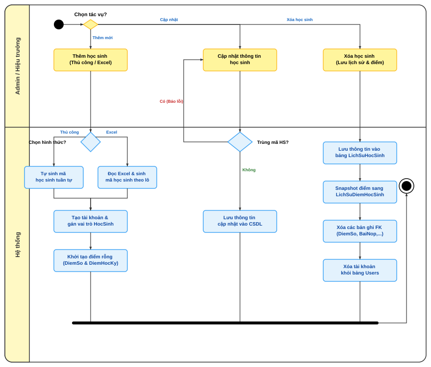

---

## 14. Quản lý Giáo viên

Quy trình quản lý danh sách giáo viên, thêm giáo viên mới (tự động tạo mã dạng GVxxxx), phân công giảng dạy (MonHocGiaoVien) và lớp chủ nhiệm (GVCN), cập nhật thông tin cá nhân, dọn dẹp các ràng buộc lịch học/lớp học khi xóa giáo viên, hoặc khóa/mở khóa tài khoản giáo viên.

```mermaid
flowchart TD
    %% Phân làn (Swimlanes)
    subgraph Admin ["Admin / Ban giám hiệu"]
        StartNode(( ))
        ChooseAction{"Chọn tác vụ?"}
        
        CreateGV["Thêm giáo viên mới"]
        UpdateGV["Cập nhật giáo viên"]
        DeleteGV["Xóa giáo viên"]
        ToggleGV["Khóa / Mở tài khoản"]
    end

    subgraph HeThong ["Hệ thống"]
        GenMaGV["Tự sinh mã giáo viên GVxxxx"]
        CreateGVAcc["Tạo tài khoản & gán vai trò GiaoVien"]
        AssignGVCN["Phân công giáo viên chủ nhiệm (nếu chọn)"]
        AssignSubject["Tạo MonHocGiaoVien dạy học lớp (nếu chọn)"]
        
        SaveGVInfo["Cập nhật thông tin hồ sơ trong Users"]
        ResetGVCN["Thu hồi lớp chủ nhiệm cũ"]
        AssignNewGVCN["Gán giáo viên chủ nhiệm lớp mới"]
        
        RemoveSubject["Xóa các phân công dạy (MonHocGiaoVien)"]
        RemoveSchedules["Xóa lịch giảng dạy (LichHoc)"]
        ResetGVCNOld["Gỡ thông tin GVCN ở lớp cũ"]
        DeleteGVAcc["Xóa tài khoản giáo viên khỏi bảng Users"]
        
        ToggleIsActive["Cập nhật trường IsActive tài khoản"]
        
        EndNode(( ))
    end

    %% Luồng Admin / Ban giám hiệu
    StartNode --> ChooseAction
    ChooseAction -- "Thêm giáo viên" --> CreateGV
    ChooseAction -- "Cập nhật thông tin" --> UpdateGV
    ChooseAction -- "Xóa giáo viên" --> DeleteGV
    ChooseAction -- "Khóa/Mở" --> ToggleGV

    %% Luồng Thêm giáo viên
    CreateGV --> GenMaGV
    GenMaGV --> CreateGVAcc
    CreateGVAcc --> AssignGVCN
    AssignGVCN --> AssignSubject

    %% Luồng Cập nhật giáo viên
    UpdateGV --> SaveGVInfo
    SaveGVInfo --> ResetGVCN
    ResetGVCN --> AssignNewGVCN

    %% Luồng Xóa giáo viên
    DeleteGV --> RemoveSubject
    RemoveSubject --> RemoveSchedules
    RemoveSchedules --> ResetGVCNOld
    ResetGVCNOld --> DeleteGVAcc

    %% Luồng Khóa / Mở tài khoản
    ToggleGV --> ToggleIsActive

    %% Hội tụ về EndNode
    AssignSubject --> EndNode
    AssignNewGVCN --> EndNode
    DeleteGVAcc --> EndNode
    ToggleIsActive --> EndNode

    %% Gán class kiểu dáng cho Start/End Node
    class StartNode startNode;
    class EndNode endNode;

    %% Định nghĩa kiểu dáng chuẩn UML cho Start/End Node
    classDef startNode fill:#000,stroke:#000,stroke-width:1px,width:20px,height:20px;
    classDef endNode fill:#000,stroke:#000,stroke-width:6px,width:20px,height:20px;
```

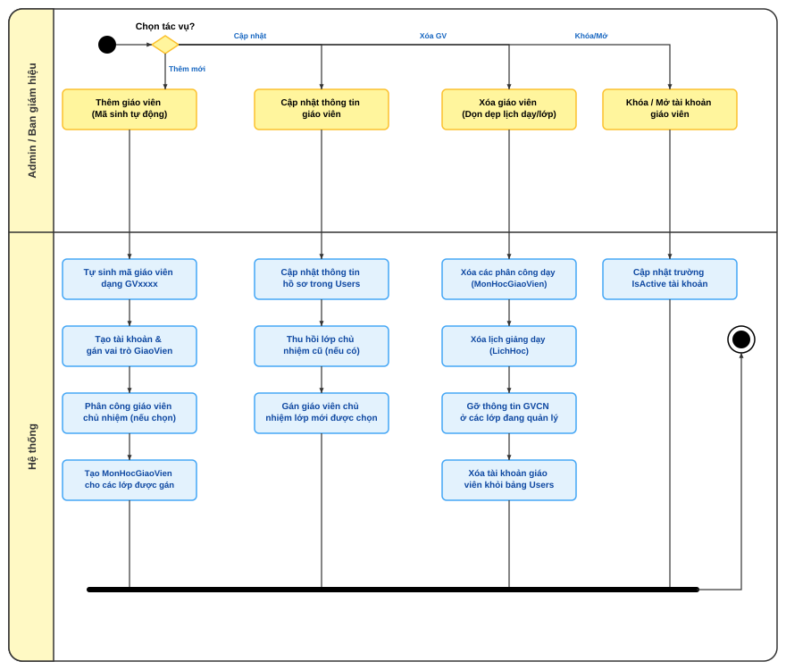

